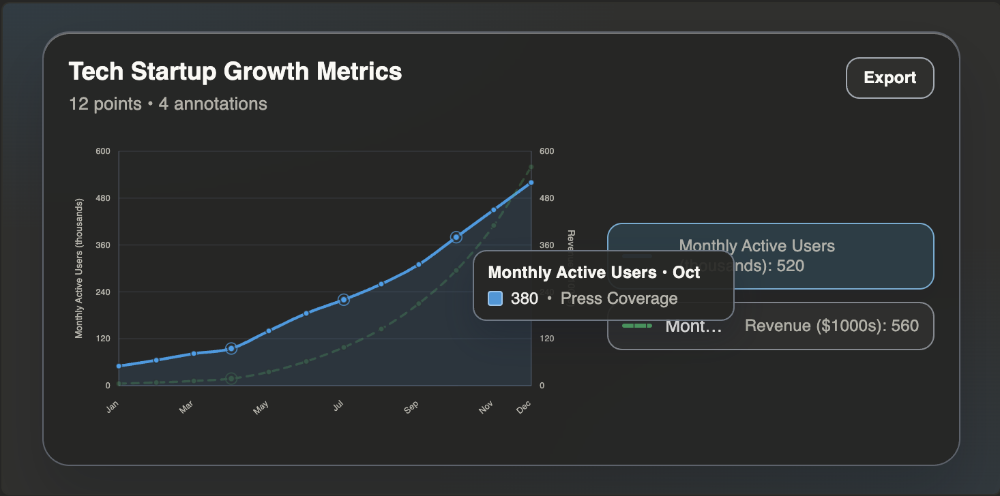
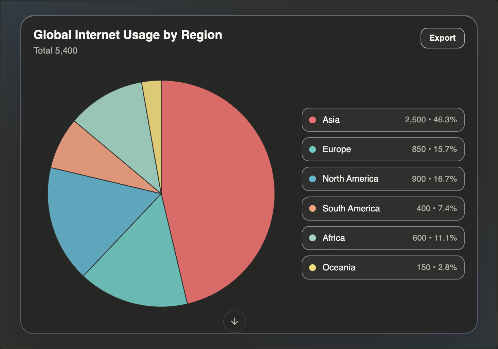
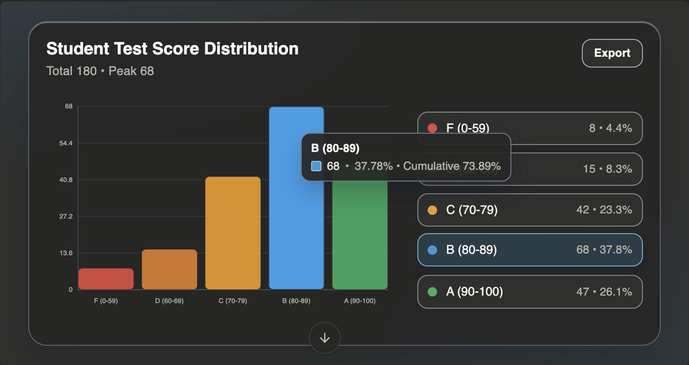

# Charts MCP

An MCP server that renders interactive charts as UI resources. It exposes tools for pie charts, funnel charts, distribution charts, and annotated time series — each returning both a structured text summary for the model and an interactive SVG visualization for the client.

## Tools

| Tool | Description |
|------|-------------|
| `render_pie_chart` | Pie chart with legend and hover tooltips |
| `render_funnel_chart` | Vertical funnel showing conversion steps and drop-off |
| `render_distribution_chart` | Bar chart with bins, percentages, and cumulative values |
| `render_annotated_time_series_chart` | Multi-series line chart with dual Y-axes and annotations |

All charts support SVG/PNG export and adapt to the host's theme via CSS variables.

## Examples

**Annotated Time Series**


**Pie Chart**


**Distribution Chart**


## Local Installation

```bash
git clone <repo-url>
cd Charts-MCP
npm install
npm start        # builds the frontend bundle and starts the server
```

The server runs on `http://localhost:3003` by default. Set `PORT` or `MCP_PORT` to change it.

## Using with an MCP Client

Add the server to your MCP client configuration:

```json
{
  "mcpServers": {
    "charts": {
      "url": "http://localhost:3003/mcp"
    }
  }
}
```

The server uses Streamable HTTP transport. Each client connection gets its own isolated session.
